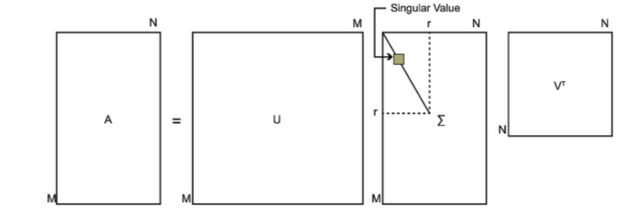

# 定理

令 $\boldsymbol{A} \in \mathbb{R}^{m \times n}$，则存在正交矩阵 $\boldsymbol{U} \in \mathbb{R}^{m \times m}$ 和 $\boldsymbol{V} \in \mathbb{R}^{n \times n}$，使得：

$$ \begin{equation}\boldsymbol{A}=\boldsymbol{U} \boldsymbol{\Sigma} \boldsymbol{V}^{\mathrm{T}}\end{equation} $$

其中：

$$\boldsymbol{\Sigma}=\left[\begin{array}{ll}\boldsymbol{\Sigma}_{1} & \boldsymbol{O} \\\boldsymbol{O} & \boldsymbol{O}\end{array}\right]$$

且 $\boldsymbol{\Sigma}_{1}=\operatorname{diag}\left(\sigma_{1}, \sigma_{2}, \cdots, \sigma_{r}\right)$，其对角元素按照顺序 $\sigma_{1} \geqslant \sigma_{2} \geqslant \cdots \geqslant \sigma_{r}>0, \quad r=\operatorname{rank}(\boldsymbol{A})$ 排列。

# 证明

因为 $\boldsymbol{A}^{\mathrm{T}} \boldsymbol{A} \geqslant 0$，所以 $\sigma(\boldsymbol{A}^{T} \boldsymbol{A}) \subseteq[0,+\infty)$。记 $\sigma(\boldsymbol{A}^{\mathbf{T}} \boldsymbol{A})=\left\{\sigma_{1}^{2}, \sigma_{2}^{2}, \cdots, \sigma_{n}^{2}\right\}$，并将它们的顺序安排成 $\sigma_{1} \geqslant \sigma_{2} \geqslant \cdots \geqslant \sigma_{r}>0=\sigma_{r+1}=\cdots=\sigma_{n}$。令 $v_{1}, v_{2}, \cdots, v_{n}$ 是对应的正交特征向量组，而且：

$$ \begin{aligned}&\boldsymbol{V}_{1}=\left[{v}_{1}, {v}_{2}, \cdots, {v}_{r}\right] \\&\boldsymbol{V}_{2}=\left[{v}_{r+1}, {v}_{r+2}, \cdots, {v}_{n}\right]\end{aligned} $$

于是，若 $\boldsymbol{\Sigma}_{1}=\operatorname{diag}\left(\sigma_{1}, \sigma_{2}, \cdots, \sigma_{r}\right)$，则有 $\boldsymbol{A}^{T} \boldsymbol{A} \boldsymbol{V}_{1}=\boldsymbol{V}_{1}\boldsymbol{\Sigma}_{1}^{2}$，由此得到：

$$ \begin{equation}\boldsymbol{\Sigma}_{1}^{-1} \boldsymbol{V}_{1}^{T} \boldsymbol{A}^{T} \boldsymbol{A} \boldsymbol{V}_{1}\boldsymbol{\Sigma}_{1}^{-1}=\boldsymbol{I}\end{equation} $$

另有，$\boldsymbol{A}^{T} \boldsymbol{A} \boldsymbol{V}_{2}=\boldsymbol{V}_{2} \times \boldsymbol{O}$ 使得 $\boldsymbol{V}_{2}^{\mathrm{T}} \boldsymbol{A}^{\mathrm{T}} \boldsymbol{A} \boldsymbol{V}_{2}=\boldsymbol{O}$，因此 $\boldsymbol{A} \boldsymbol{V}_{2}=\boldsymbol{O}$。令 $\boldsymbol{U}_{1}=\boldsymbol{A} \boldsymbol{V}_{1} \boldsymbol{\Sigma}_{1}^{-1}$，则由（2）式，我们有：$\boldsymbol{U}_{1}^{\mathbf{T}} \boldsymbol{U}_{1}=\boldsymbol{I}$。选择任意 $\boldsymbol{U}_{2}$，使得 $\boldsymbol{U}=\left[\boldsymbol{U}_{1}, \boldsymbol{U}_{2}\right]$ 正交。于是，

$$ \boldsymbol{U}^{\mathbf{T}} \boldsymbol{A} \boldsymbol{V}=\left[\begin{array}{ll}\boldsymbol{U}_{1}^{\mathbf{T}} \boldsymbol{A} \boldsymbol{V}_{1} & \boldsymbol{U}_{1}^{\mathrm{T}} \boldsymbol{A} \boldsymbol{V}_{2} \\\boldsymbol{U}_{2}^{\mathrm{T}} \boldsymbol{A} \boldsymbol{V}_{1} & \boldsymbol{U}_{2}^{\mathrm{T}} \boldsymbol{A} \boldsymbol{V}_{2}\end{array}\right]=\left[\begin{array}{cc}\boldsymbol{\Sigma}_{1} & \boldsymbol{O} \\\boldsymbol{U}_{2}^{\mathrm{T}} \boldsymbol{U}_{1} \boldsymbol{\Sigma}_{1} & \boldsymbol{O}\end{array}\right]=\left[\begin{array}{cc}\boldsymbol{\Sigma}_{1} & \boldsymbol{O} \\\boldsymbol{O} & \boldsymbol{O}\end{array}\right]=\boldsymbol{\Sigma} $$

从而得到所希望的结果：$\boldsymbol{A}=\boldsymbol{U} \boldsymbol{\Sigma} \boldsymbol{V}^{\mathrm{T}}$。

其中，数值 $\sigma_{1}, \sigma_{2}, \cdots, \sigma_{r}$ 连同 $\sigma_{r+1}=\sigma_{r+2}=\cdots=\sigma_{n}=0$ 一起称为矩阵 $A$ 的奇异值。