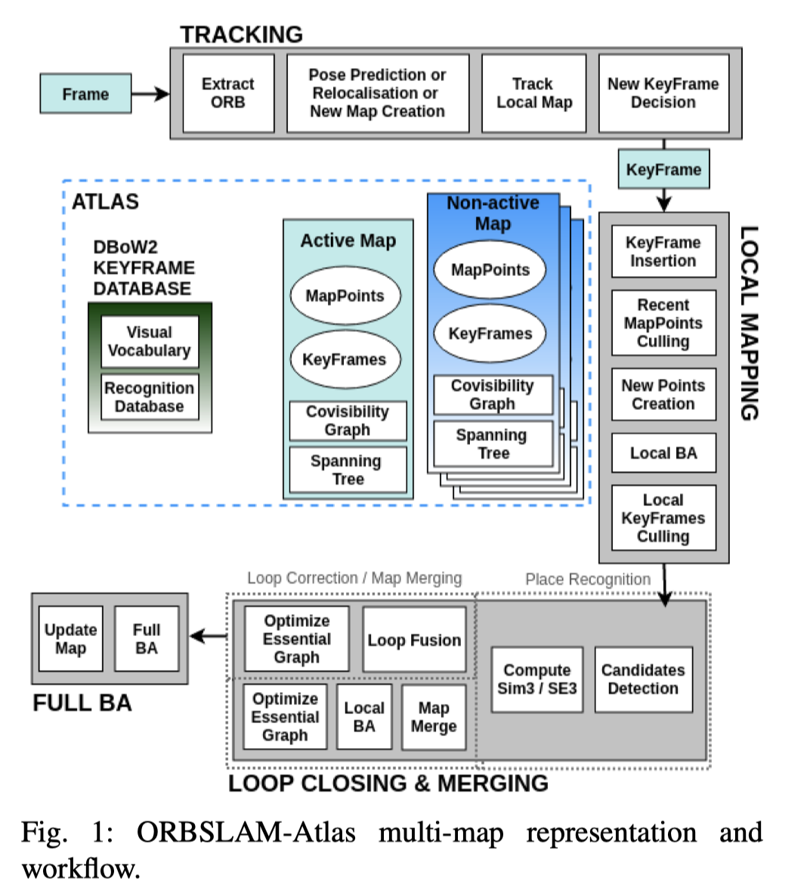

Author: Richard Elvira, Juan D. Tardos and J.M.M. Montiel

Publisher: IROS 2019

ORBSLAM-Atlas是基于ORBSLAM2的一个改进，其在ORBSLAM2的基础上引入了多地图的概念，能够处理无限数量的不相连的子地图。ORBSLAM-Atlas系统中使用的地图合并算法能够检测具有公共区域的子地图并无缝的对他们进行融合。

引入多地图的一个好处是，如果在SLAM运行过程中丢失了跟踪，那么可以先暂时将之前所建立的子地图冻结起来，然后新建立一个新的地图，倘若再访问到之前子地图的公共区域时，我们可以将当前地图与之前冻结的子地图进行融合，合并为更准确的全局地图。

Tracking无法运行的情况：

1. 当前帧和局部地图中的地图点的匹配数低于给定阈值
2. 如果检测到的点的几何条件不佳，则将无法观察到相机姿态，那么相机定位估计将不准确。