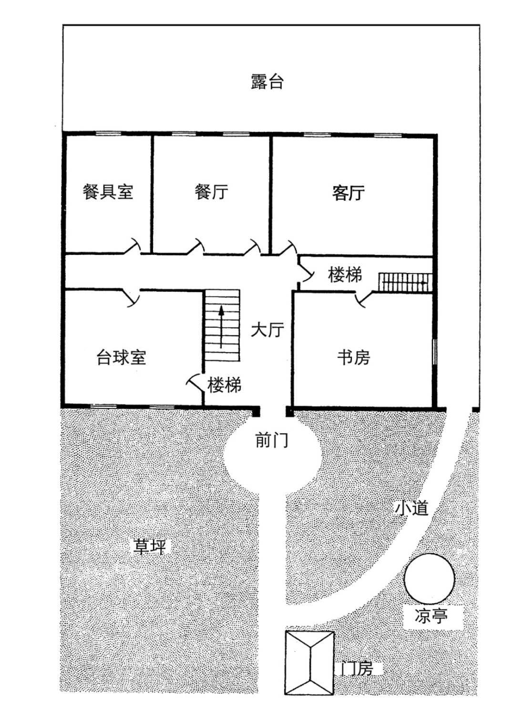
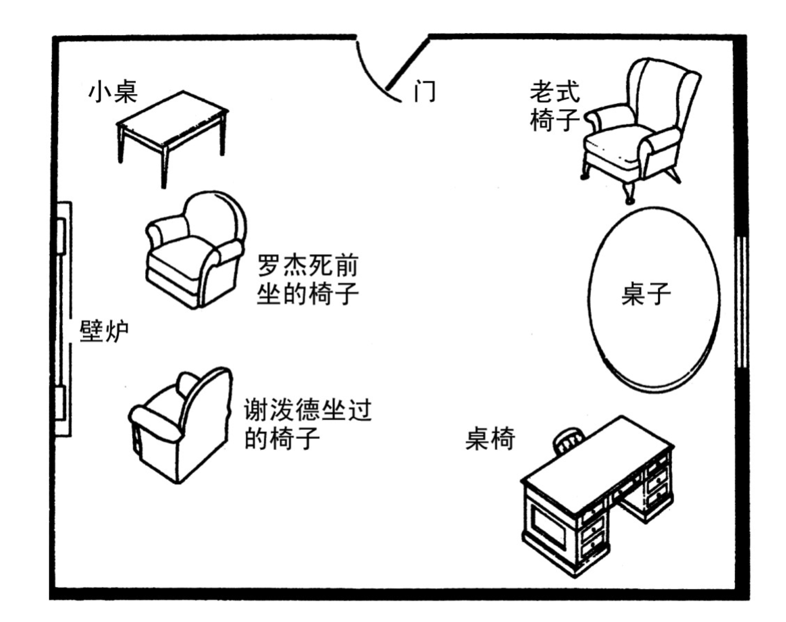

# 简介

全名：《罗杰疑案》

作者：阿加莎·克里斯蒂

分类：[[书籍分类#推理小说|推理小说]]

阅读进度：已阅读（1次）

豆瓣评分：9.3

豆瓣链接：[https://book.douban.com/subject/34985248/](https://book.douban.com/subject/34985248/)

微信读书链接：[https://weread.qq.com/web/reader/2ce329305b1dca2ceb95926](https://weread.qq.com/web/reader/2ce329305b1dca2ceb95926)

# 读书笔记

## 芬利庄园一楼图

## 芬利庄园书房

## 问题

- 谁在敲诈弗拉尔斯太太？（布兰特）
- 谁杀死了艾克罗伊德先生？（布兰特）
- 是谁打电话通知医生？（拉尔夫·佩顿）为什么
- 短剑是被谁拿出来的？（布兰特）
- 少的钱是谁拿的？（弗洛拉小姐）
- 凳子是谁移动的？（）

## 有杀人嫌疑者

**拉尔夫·佩顿**

艾克罗伊德先生的养子，

- 拉尔夫·佩顿与弗拉尔斯太太在弗拉尔斯太太死之前一天在一起。

**塞西尔·艾克罗伊德太太**

艾克罗伊德先生的弟媳，以遗孀的身份在芬利庄园定居。

**弗洛拉·艾克罗伊德小姐**

艾克罗伊德先生的侄女，和拉尔夫订婚，喜欢布兰特少校。

- 拿钱了，用于还贷款

**布兰特少校**

狩猎大王，寡言少语。

- 继承的那笔遗产，总额将近两万英镑；而弗拉尔斯太太被敲诈的钱也是两万英镑左右

动机：

**帕克**

芬利庄园男管家。

- 敲诈已故主人，

**雷蒙德**

艾克罗伊德的秘书

动机：

**厄休拉**

客厅女仆，与拉尔夫·佩顿相爱，结婚

**拉塞尔小姐**

芬利庄园女管家。

- 去找谢泼德医生看过膝盖，同时问过关于毒瘾（她儿子染上了毒瘾）和无法被人发现的毒药的事情（？）
- 晚上参加晚宴时，谢泼德医生进入客厅时，发现有关窗户的声音（确认后应该是关上银桌的声音，银桌里面装的是古玩），刚好碰到拉塞尔小姐正从客厅往外走，并且喘着粗气，可能刚从外面回来（？）

**查尔斯·肯特**

拉塞尔小姐的儿子，染上了毒瘾，九点去过庄园。

## 其他人物

**罗杰·艾克罗伊德**

死者，芬利庄园主人，与一名叫做佩顿的寡妇结婚，结婚四年后，艾克罗伊德夫人因为酗酒去世。

**弗拉尔斯太太**

皇家围场主人，为了能跟罗杰·艾克罗伊德在一起，毒死弗拉尔斯先生，因为一直被敲诈，受不了而自杀。

**波洛**

著名侦探，

**谢泼德医生**

故事的讲述者，

- 两人仿佛都隐约听到了门闩的轻微响动（帕克在偷听）
- 九点离开芬利庄园，见到一个年轻男子（年轻男子是拉塞尔小姐的儿子，去找拉塞尔小姐要钱）
- 九点十分到家，十点准备睡觉，十点十五接到电话，不是帕克打的

**卡洛琳**

谢泼德医生的姐姐，喜欢八卦和大嘴巴

**甘尼特小姐**

## 现场

- 艾克罗伊德还和我临走时一样，坐在壁炉前那把扶手椅中。他的脑袋歪到一旁，就在他外套的衣领下，一柄锃亮的剑寒光闪闪。
- 在手电筒的亮光下，几个清晰的鞋印无所遁形。这些鞋印像是那种有橡胶鞋钉的鞋子留下的，其中有个特别明显的鞋印方向朝内，另一个和它稍有部分重叠，方向朝外。

## 证词

- “艾克罗伊德先生九点半的时候肯定还活着，”雷蒙德插嘴，“因为我听到他在这屋里说话。”（？）

“断断续续听见几句，”秘书答道，“而且，因为我原以为和艾克罗伊德先生交谈的是谢泼德医生，所以觉得那些话听起来特别奇怪，具体内容我还记得很清楚。艾克罗伊德先生说：‘近来你伸手要钱的次数未免过于频繁，’他的原话正是如此，‘因此我不可能继续满足你的要求……’然后我马上离开了，所以没听到下文。但我确实莫名其妙，因为谢泼德医生——”

- 帕克：“恕我直言，先生，后来弗洛拉小姐还和他见过面。”，“是的，长官。大约九点四十五分。然后她还告诉我，今晚别再去打扰艾克罗伊德先生。”（弗洛拉小姐说谎了）
- 短剑？
- 布兰特结结巴巴地解释：“我想当然地觉得那是雷蒙德，因为我去露台之前，他说要送几份文件给艾克罗伊德。我从没考虑其他人的可能性。”

我觉得嫌疑犯应该是个男的

| 人物/时间       | 9:00-9:15    | 9:15-9:30      | 9:30-9:45                                    | 9:45-10:00   |
| ----------- | ------------ | -------------- | -------------------------------------------- | ------------ |
| 书房          |              |                |                                              |              |
| **拉尔夫·佩顿**  |              | 9:25进入庄园       |                                              |              |
| 厄休拉         |              |                |                                              |              |
| 塞西尔·艾克罗伊德太太 |              |                |                                              | 台球室，9点55上楼睡觉 |
| 弗洛拉·艾克罗伊德小姐 |              |                |                                              | 伯父房间然后上楼？    |
| **布兰特少校**   |              |                | 9:30，在客厅的窗外抽着烟，看见一个女人钻进了树丛，听见雷蒙德和艾克罗伊德先生在说话？ | 台球室          |
| **帕克**      |              |                |                                              | 餐具室          |
| **杰弗里·雷蒙德** |              |                |                                              | 台球室          |
| 拉塞尔小姐       | 9:10去见查尔斯·肯特 |                | 9:30回屋？                                      | 餐具室          |
| **查尔斯·肯特**  |              | 9:20-9:25离开庄园？ |                                              | 酒吧           |

# 摘录