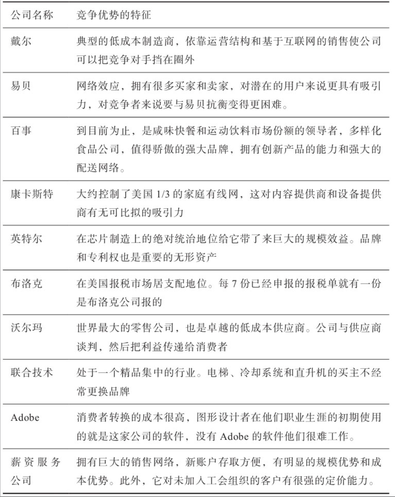
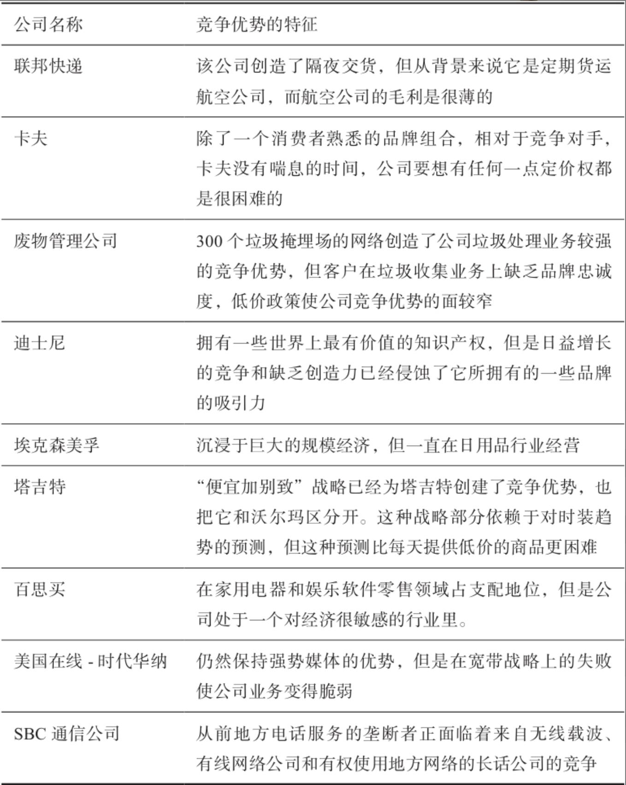
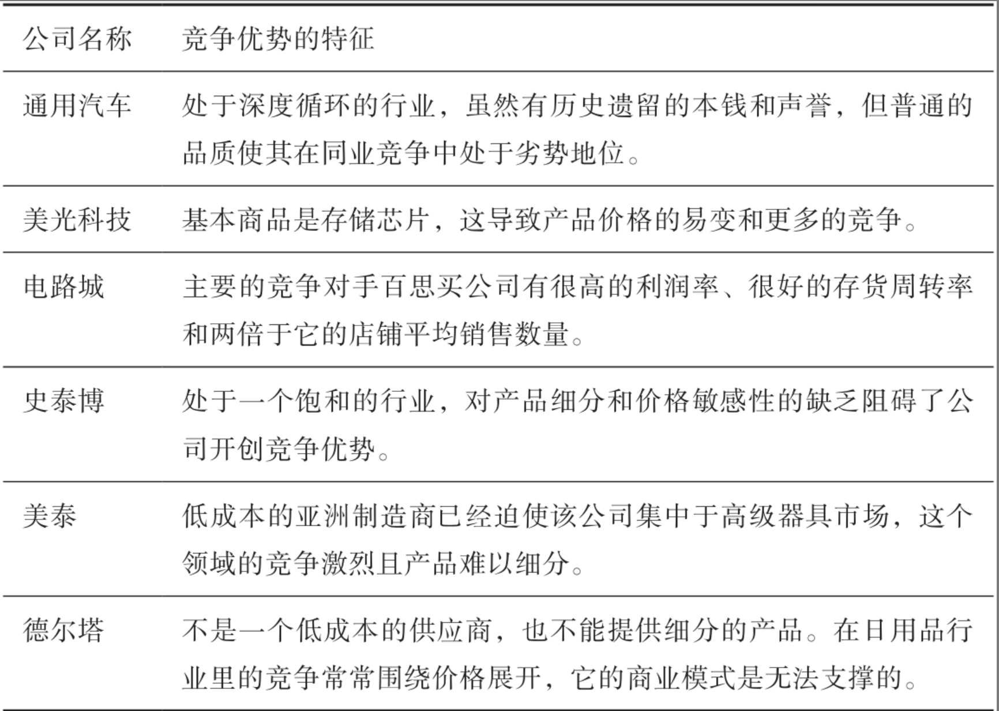
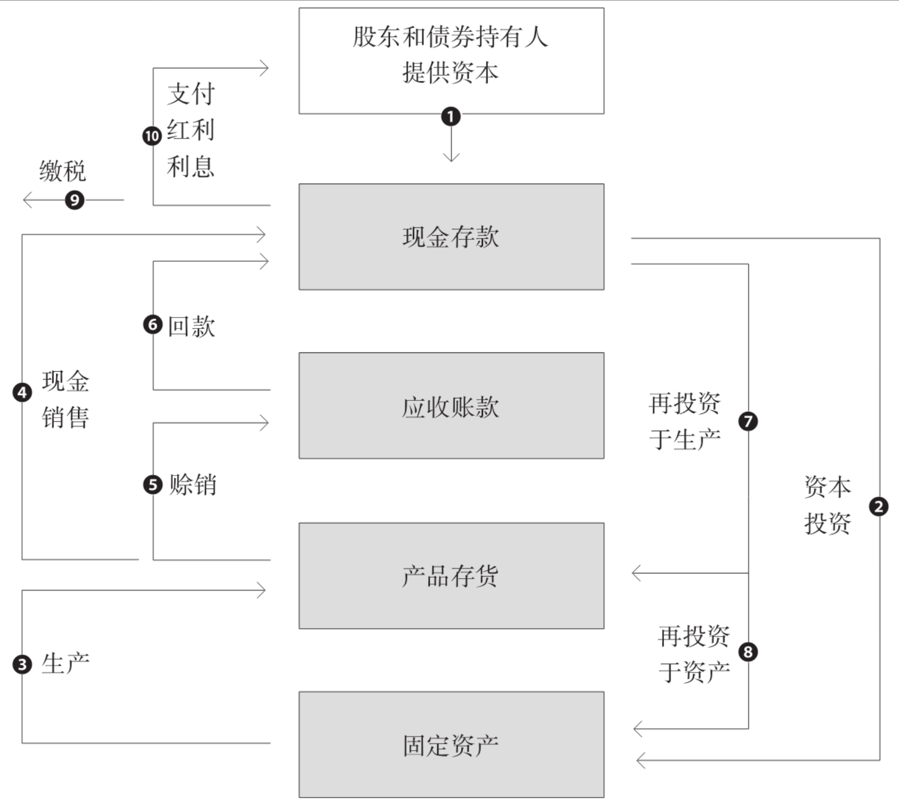

# 简介

全名：《股市真规则：站在巴菲特和晨星公司的肩上投资》

作者：（美国）帕特·多尔西

分类：[[书籍分类#投资理财|投资理财]]

阅读进度：正在读

豆瓣评分：9.1

豆瓣链接：[https://book.douban.com/subject/30194663/](https://book.douban.com/subject/30194663/)

微信读书链接：

# 读书笔记

# 摘录

## 第一章 成功投资股市的五项原则

### 1 做好你的功课

你必须发挥你对会计学的理解，以便你自己决策时能确切知道一家公司真实的财务状况。（第4～7章）

一旦你掌握了这些工具，就要花时间使用这些工具，你要坐下来把年度报告从封面读到封底，并且浏览过去的财务报表，评估行业内的竞争者。这是需要坚持的，要挤出时间，因为花时间彻底调查研究一家公司有助于你避免不良投资。

### 2 寻找具有强大竞争优势的公司

竞争优势可以使一小部分公司在很多年中保持平均水平之上的利润率，这些公司常常是最好的长期投资对象。

识别较强竞争优势的关键是能对一些具有迷惑性但其实很简单的问题做出回答，比如：一家公司是怎样设法使竞争者无路可走，从而使自己获得丰厚利润的？如果你能够回答这个问题，你就能发现这家公司竞争优势的源头了。

### 3 拥有安全边际

发现好公司只完成了投资过程的一半，另一半工作则是评估这家公司的价值。（第9～10章）

任何一个投资者的目标都应当是在价格低于股票价值时买入。

股票的市价与我们的估价之间的差额就是这只股票的安全边际。

不赚钱比损失已拥有的金钱痛苦要小得多。

### 4 长期持有

永远不要忘记，买股票是一个重大的购买行为，并且你要把它当作重要的投资行为对待。你应该不会在一年之内买卖你的汽车、冰箱50次。投资应该是一项长期的交易，因为短期的交易意味着你正在玩一种失败者的游戏。频繁短期交易的费用如果合计起来，包括税收和佣金，会给你的投资业绩造成几乎不可逾越的障碍。

### 5 知道何时卖出

关键是，要持续不断地关注你持有股票的那家公司，你对公司的关注要胜过对持有的那只股票的关注。你花时间关注你所买入股票的那家公司的新闻和所处行业的信息，远比你一天看20次股价要有用。

你要牢记，当你买入股票以后，股票走势不是最重要的。你不能改变过去，市场也不关心你是赚了还是赔了。影响股票价格的是该公司的未来，而且那才是你决定是否要卖出股票的依据。

什么时候股票不能卖出：

- 股价已经回落
- 股票已经猛涨

什么时候卖出股票呢？需要考虑下面五个问题：

1. 你是否犯了某个错误？你在第一次评估这家公司时遗漏了某些事情吗？
2. 基本面已经恶化了吗？
3. 股价是否已远远高出它的内在价值？
4. 你的这些钱有更好的投向吗？作为一个投资者，你应该不断地寻找有更高回报的机会来分配你的资金。为了购买前景更好的股票，卖出一个稍微有点被低估的股票，即使你亏了钱，也没有什么可惜的。
5. 你在一只股票上投资太多了吗？简单地说，“把鸡蛋放在一个篮子里”是危险的。

## 第二章 七个应当避免的错误

### 1 虚幻的目标

### 2 相信这次与以往不同

### 3 陷入对公司产品的偏爱

### 4 在市场下跌时惊慌失措

股票最有吸引力的时候，通常是在没有人想买股票的时候，而不是在连理发师都能给股票开出最高价的时候。投资时往往有一种诱惑，就是要证实或求证其他人也在做同样的事情。但是历史再三地告诉我们，当每一个人都在避开购买这些资产的时候，往往是它们最便宜的时候。

**最悲观的时候是最好的买入时机。**

违背自己的性格和意愿需要勇气，但是这种勇气是有报酬的。如果你善于独立思考并从别人遗弃的市场上捡到便宜货，你就会成为一个好的投资者，这远比因为财经报刊的吹捧而购买股票强得多。

### 5 试图选择市场时机

### 6 忽视估值

### 7 依赖盈利数据做分析

最后，至关重要的是**现金流**（第5～6章），而不是盈利。因为基于每股盈利的会计处理可以做出公司管理层想要的利润，但是现金流却是很难胡来的。你可以通过现金流量表判断一家公司的财务健康状况，并且通过观察经营性现金流相对盈利的变化趋势，在一些会导致公司崩溃的问题暴发前就发现它们。

**要注意：如果公司在经营性现金流停滞或收缩的同时盈利却在增长，很可能是某些事情正在变坏。**

## 第三章 竞争优势

高额的利润往往伴随着激烈的竞争，资本追逐高回报是任何一个自由竞争市场的天性。因此，经过一段时间，当竞争者打破特许经营权之后，大部分高盈利的企业利润都会减少。

分析一家公司的竞争优势，可以遵循下面四个步骤：

1. 评估公司历史上的盈利能力。这家公司的资产和所有者权益一直能够创造稳定收益吗？这是一家公司是否建立起竞争优势的真正的试金石。
2. 如果这家公司的资本有稳定的收益，并能有持续不断的盈利能力，就需要评估公司利润的来源：为什么这家公司能阻挡竞争者，是什么阻止竞争者窃取它的利润？
3. 评估一家公司能阻挡竞争者多久，这是该公司竞争优势的周期。一些公司能阻挡竞争者仅仅几年的时间，而另一些公司可以阻挡几十年。
4. 分析行业竞争结构。行业内的公司是怎样和其他公司竞争的呢？这是一个很有利可图的、有吸引力的行业，还是一个参与者都在痛苦挣扎的过度竞争的行业？

### 1 评估收益性

我们首先需要做的是通过调查公司的财务状况，寻找公司拥有竞争优势的确实证据。

我们寻找的公司是那些所赚利润超过资本成本——能够产生相对于投资数量持续稳定的现金流的公司。

当你考察全部四个度量指标时，要考察5年以上的数据。

#### 自由现金流

这家公司产生**自由现金流**（free cash flow,FCF）吗？如果产生，是多少呢？自由现金流等于经营性现金流减去资本支出现金流。

公司的自由现金流本质上指再投资后还有资金的剩余，因为公司需要保持生意继续兴旺。在某种意义上，自由现金流是一家公司可以每年提取但不致损害核心业务的资金。

下一步，把销售额（或收入）与自由现金流分开，它将告诉你公司的每1美元收入能转换成超额利润的比例。如果一家公司的自由现金流在销售收入的5%左右或更多，你就找到一个印钞机器了——到2003年中期，只有标准普尔500成分股达到了这样的标准。强大的自由现金流是一家公司拥有竞争优势的极好信号。

#### 净利润

净利润可以从另一个角度考察公司的盈利能力。净利润是销售收入的一个百分比，它告诉你每1美元的销售收入产生多少利润（你能在公司的利润表上找到销售收入和净收入，而任何一套完整正规的财务报表都有利润表）。一般而言，公司净利润在15%以上就说明它的经营活动是良好的。

#### 净资产收益率（returns on equity，ROE）

净资产收益率是净收益相对所有者权益的百分比，它可用来衡量股东在公司投资每1美元产生的利润。尽管净资产收益率有一些缺陷（这一点我们在第六章讨论），但它仍然是一个全面评估盈利能力的好工具。凭经验可知，如果公司能够持续不断地显示有高于15%的净资产收益率，通常表明股东的投资正在产生稳定的回报，这意味着这些公司很可能有竞争优势。

#### 资产收益率

资产收益率是净收益相对公司全部资产的百分比，它用来度量企业资产转化成利润的效率。6%~7%可作为一个粗略的基准——如果一家公司的资产收益率能够持续超过这个比率，说明它可能有相对同行业的竞争优势。

### 2 建立竞争优势

当你检验公司竞争优势的来源时，关键是要不停地问“为什么”：

- 为什么竞争者不能夺走它的消费者？
- 为什么竞争者不能对类似的产品或服务给出一个更低的价格？
- 为什么消费者能接受每年的价格上涨？

从消费者的角度来看：

- 企业的产品和服务给消费者带来了什么价值？
- 它是怎样帮助企业更好地经营自己的生意的？
- 为什么消费者会用一家企业的产品和服务而不是竞争对手的产品或服务？

一般而言，一家独立的公司要建立足够的竞争优势有五条途径：

1. 通过出众的技术或特色创造**真实的差异化产品**；
2. 通过一个信任的品牌或声誉创造**可感知的差异化产品**；
3. **降低成本**并以更低的价格提供相似的产品和服务；
4. 通过创造**高的转换成本**锁定消费者；
5. 通过建立**高的进入壁垒**把竞争者阻挡在外面。

### 3 优势能持续多久

评估竞争优势能持续多久是一个难题，但你至少应该思考，即使你得不出一个准确的答案。把一个公司分成三个时间段（很短几年、几年和很多年）来考察是一种有用的方法。

一般而言，**基于技术的竞争优势是比较短暂的**。例如，成功的软件公司能产生巨大的回报，因为这些公司有很高的利润率，而且不需要在固定成本上投资很多。但因为技术发展和变化速度飞快，这些公司的回报周期是很短暂的。换句话说，今天的领导者可能就是明天的失败者，因为进入门槛太低而潜在的回报又太高。

过成本优势、品牌、锁定消费者和把竞争者阻挡在外面等各种途径，能形成不同时间长度的竞争优势阶段。

下面是一些具有强劲竞争优势的典型公司：

一些竞争优势面窄的典型公司：

一些没有竞争优势的典型公司：

### 4 分析行业竞争结构

尽管这个行业的吸引力不能告诉你企业的全部，但对竞争前景有天才的判断是相当重要的。一些行业就是比其他行业赚钱容易。

首先，要对行业有一个大致的印象，然后你才能把它分类：

- 在行业里销售费用削减的情况通常是在增长还是在收缩？
- 公司是一直有钱可赚，还是大多数公司开始亏损、行业进入循环周期？
- 这个行业是被极少数大厂商控制，还是充满了规模大致相当的厂商？
- 厂商的平均盈利水平——营业毛利率是相当高（高于25%）还是相当低（低于15%）？

通过汇总的统计数据，你能回答一些问题，比如平均增长率、平均毛利率等。无论如何，平均值并不能告诉你行业的每一个方面，所以你一定要调查一定数量的公司的情况。做这件事的一个简单方法就是看这个行业销售收入或市值的排行榜，调查十几家公司就能对这个行业找到一些感觉。

你不用在这一点上做详细的分析，只需要浏览一下销售收入、盈利增长率和毛利率。最重要的是，寻找各种公司一个较长时期（至少5年，也许是10年）的分析框架。

## 第四章 投资语言

### 财务报表基础

作为一个投资者，你应该对资产负债表、利润表和现金流量表感兴趣。这三张报表是你了解公司表现的窗口，而且也是我们分析一家公司的起点。

这三张报表在三份主要的财务文件中：年度报告，10-K报告和10-Q报告。

#### 资产负债表

资产负债表就像一家公司的信用报告，因为它反映的是在某一特定时点这家公司拥有的资产和负债情况。它告诉你这家公司的框架和基础的牢固程度。

#### 利润表

利润表告诉我们这家公司一年或者一个季度赚了或者损失了多少**会计利润**。利润表不像资产负债表那样是公司财务健康状况的一个精确时点的快照，利润表记录了一个时段比如一个财务年度的收入和费用。

#### 现金流量表

最后还有现金流量表，它记录流入和流出公司的全部现金情况。现金流量表把利润表和资产负债表联系在一起。

利润表和现金流量表细微的差别就在于一个被称为“**权责发生制**”（accrual accounting）的容易混淆的概念。看一下它是怎样起作用的：当一项服务或一种物品提供给买家的时候，公司记录销售额或收入，不管买家何时付款。只要公司有理由确认买家最终会付款，公司就要把这笔销售反映在利润表上。另一方面，现金流量表只与收到现金或者支出现金有关。

### 资金的流动

下图说明了资金是怎样从一个投资者通过公司到消费者，然后又回到公司的过程，即一家公司的现金流入和现金流出。

一组投资者和债券的持有人①给公司提供资本，对股东来说就是买了股票，对债券持有人就是买了债券。公司用这些资金购置了固定资产②，比如一些机器设备和建筑物。用这些资产生产出产品，就是存货③，一些存货卖出后变成现金④，另外一些赊销⑤。赊销被反映为应收账款，直到消费者给公司付款⑥。一旦公司手里有现金，公司又按照同样的路径把它花出去。一些现金以产品的形式返回来⑦，这意味着可以购置原材料生产更多的存货。另一部分现金用于投资⑧，这意味着买更多的机器设备或建造另外的工厂（用会计学的行话说，你通常看到一些投资购买了切实的长期资产，像一座建筑物或工厂，这叫作“资本支出”）。还有一大块现金给政府交税了⑨。如果给股东分红派息，或者公司有负债的，还要向股东和债券持有人支付红利和利息，于是一部分现金流出⑩。

## 第五章 财务报表讲解

### 资产负债表

资产负债表有时也叫“财务状况表”，它告诉你一家公司拥有多少资产、多少负债，资产和负债之差就是**所有者权益**。

**资产 – 负债 = 所有者权益**

关键是要懂得资产负债表在任何时候都必须是平衡的，因此它又叫作**平衡表**。比如发行债券引起负债增长，而销售债券收到的现金也导致资产增长；公司产生大量利润会导致资产增长，同时所有者权益也在增长。

### 资产账户：流动资产

资产账户里最重要的是流动资产，因为流动资产很可能在一个商业周期里被耗尽或者转化成现金。通常商业周期被定义为一年。这类资产的主要部分是现金及其等价物、短期投资、应收账款和存货。

- 现金及其等价物和短期投资：该项目涉及存在金库中暂时不用的现金以及仅次于低风险钞票的短期投资。现金及其等价物通常包括货币市场基金，还有其他任何可以迅速转化成现金并且价格风险很低的东西。
- 应收账款：应收账款是公司还没有收到的现金，是那些如果不出现意外公司会在不久收到的货款。**你要观察这个账户与公司销售收入之间的变化，如果应收账款比销售收入增长快，说明这家公司的账上记录了大量还没有收到的款项，这可能是一个会出问题的信号，因为这意味着公司为增加销售收入提供了一个相当宽松的信用条款。**
- 存货：存货有几种类型，包括还没有制成成品的原材料、半成品和还没有销售的成品。更重要的是存货的占用资本，现金转化成存货放在仓库里不能做任何事情。一家公司的存货周转速度对收益率有巨大的影响，如果存货占用资金的时间少，这些资金就可以用到其他地方。你可以**用公司的销售成本除以平均存货水平计算出存货周转率**。

### 资产账户：非流动资产

非流动资产是那些不能转化成现金或在报告期内要耗用完的资产。它主要包括固定资产、投资和无形资产。

- 固定资产：固定资产是公司的长期资产，形成公司的基础设施：土地、建筑物、工厂、家具和设备等。
- 投资：指资金投资在长期债券或者投资在其他公司股票上，从一个象征性的数量变为一个实质性的投资。它远没有现金那样好的流动性，而且其价值可能比资产负债表上反映的数字或高或低。如果投资主要是债券，你就不需要为它太担心；但如果主要是股票投资或风险投资，你就要查清楚投资的真正价值。
- 无形资产：无形资产最普通的形态是商誉，当一家公司收购另一家公司时商誉就会上升。如果一家公司要购买可口可乐公司，它将不得不支付比可乐公司股票账面价值高得多的价格，这溢价的部分就叫作**商誉**。

### 负债账户：流动负债

流动负债是与流动资产相对的那面，它指一家公司一年内要付清的资金。它包括应付账款、短期借款或短期应付款。

应付账款：这是公司从某人或机构那里借贷并应在一年以内归还的借款。

短期借款：借款期限短于一年的借款，通常是为了应付短期的需要。

### 负债：非流动负债

与非流动资产相对应的是非流动负债，它表现为公司一年或一年以上的借款。长期负债通常是企业发行的债券，有时也是几年之内不用还的银行借款。

### 所有者权益

所有者权益等于总资产减去总负债，它也表现为公司向股东的负债。

唯一值得关注的是**未分配利润**，这是一家公司一定的资本数量存续一段时间发生的利润减去分红和股票回购后的基本记录，它也表现为股东再投资。

未分配利润是一个累计账户，因此，每一年公司赚取的利润如果没有作为红利全部分红，未分配利润就会增加。

同样，如果一家公司随着时间流逝亏损了，未分配利润可能就变成负的，在资产负债表上的账户也就改为“累计亏损”。**未分配利润是一家公司长期盈利情况的记录。**

### 利润表

- **销售收入**：公司在一个季度或一年内销售了多少。
- **销售成本**：这个数字显示的是直接创造收入的有关费用。
- **毛利润**：它是简单地把收入与销售成本相减。
- **销售和管理费用**：它指众所周知的营业费用，包括营销费用、管理人员工资，有时也包括研发费用（研发通常作为一个分开的科目）。
- **折旧和摊销**：当一家公司购置一项资产并打算使用一段时间，如一座新的建筑物或者一台新设备，那么在未来几年它要在利润表上逐步摊销那项资产的一部分成本。
- **非经营性损益**：公司会把它的全部非常规营业的一次性费用或收益放在一起，比如关闭一间工厂的费用或者卖出一个分部的收益。
- **营业利润**：这个数字等于收入减去销售成本和全部营业费用。理论上，它表现为公司在实际经营活动中赚取的利润，与之相对的是利息收益、一次性收益和其他一些非营业性项目。
- **利息收益/费用**：个数字显示的是公司为它已经发行的债券支付的或者因自己持有的债券而收到的利息。
- **税赋**：税赋是通常列在净利润之前的费用。
- **净利润**：这个数字显示公司的税后利润（至少在理论上）。尽管净利润是你常常看到大多数公司重点鼓吹的数字，但不要忘记它可以被一次性费用或者一次性投资收益野蛮地扭曲。
- **股份数字（基准和稀释）**：这个数字表示用来计算每股收益的股份数，它代表在报告期发行在外的平均股份数（一个季度或一年）。稀释的股份数包括潜在的可以转化成股票的有价证券，比如股票期权和可转换债券等。
- **每股盈利（基准和稀释）**：这个数字用净利润除以股份数表示，当一家公司报告季度或年度业绩时，这个数字通常会被注意到。但它不是财务表现最重要的部分，事实上，如果不看现金流量并综合其他很多因素，单看这个数字是没有意义的。

### 现金流量表

现金流量表是一家公司创造价值的真正的试金石，它反映的是一家公司在一个会计年度发生的现金是多少，以及现金是由哪些部分组成的。

事实上，当你估计一家公司去掉伪装之后有多少现金时，我推荐你首先要看现金流量表，然后再检验资产负债表财务基础的稳固性，最后再看利润表，查看一下毛利率等。

现金流量表分成三个部分：**经营活动发生的现金流量**、**投资活动发生的现金流量**和**筹集资金活动发生的现金流量**。

- **经营活动发生的现金流量**：它告诉你公司经营活动中发生了多少现金。这是你要关注的重点区域，因为发生现金流量的动力——经营活动是我们最需要关注的。
- 净利润：这个数字可以从利润表中直接找到，它下面的所有科目相加或相减就得到最终结果——**经营活动现金净额**。
- 折旧和摊销： 不是现金费用，比如前面例子中迈克不需要为已经磨损的烤肠夹子实际支付1美元折旧的现金，所以我们需要把它加到净利润中去。
- 员工股票计划的税收收益：当员工行使股票期权的时候，公司老板会从净利润中扣除相应的从员工购买期权中得到的利润（员工补偿通常可以抵减税收）。
- 营运资本变动
- 一次性费用
- **经营活动现金净额**：这个指标是你判断一家公司是否发生现金的“圣杯”。众所周知，经营活动现金流量就是从净利润中加上或减去这个指标的结果。它并不能代替净利润，但是如果除了净利润之外你不研究它，你就不能得到全部的图景，因为这两者常常告诉你不同的方面。
- 资本支出：这个数字显示的是花在长期性投资项目（比如固定资产）上的钱，以及公司维持当前的速度正常运转或要推动增长所需的长期性投资。（经营性现金流量 - 资本支出 = 自由现金流量）
- 投资收益：公司常常把它们过剩的现金投资到债券或股票上以获取比基本储蓄账户更高的回报。投资收益告诉我们在这些投资上这家公司已经赚取（或亏损）了多少钱。
- **筹资活动现金流量**：筹资活动包括与公司股东和债权人的所有交易。
- 支付红利
- **发行/购买普通股：**这是一个要重点关注的数字，因为它揭示的是一家公司是怎样开展筹资活动的。**成长迅速的公司常常发行大量的新股，这将稀释现有股票的价值，但也充实了公司的现金。增速较慢的公司有大量的自由现金流时，常常趋向于大量回购自己公司的股票，虽然公司向员工派发了很多股票期权，但也会回购股票以使稀释作用最小化。**
- **发行/偿还债务：**这个数字告诉你，这家公司是否有借款以及是否已经还了先前的借款。