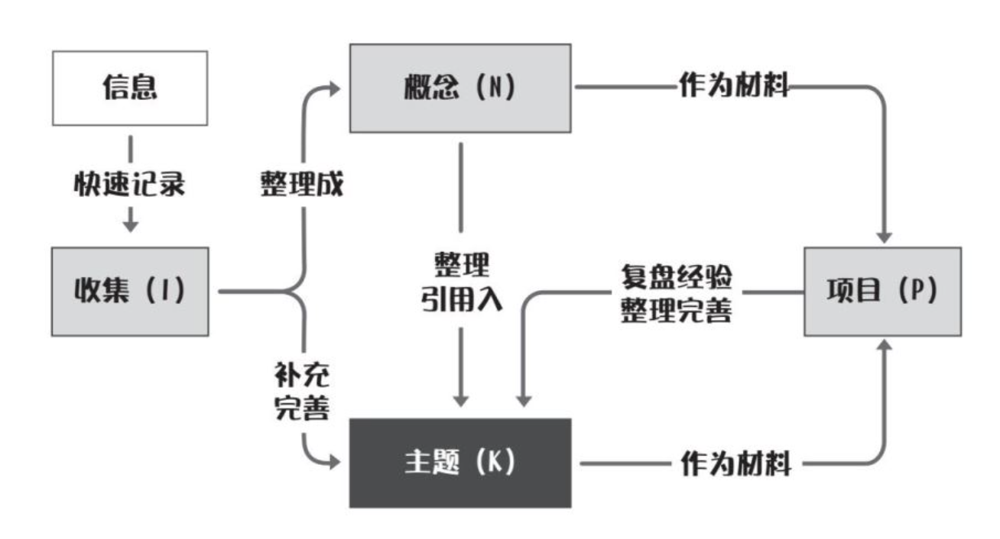

之前一直觉得自己按照每本书分别做笔记的方法不够高效，所以在寻找一种更高效的笔记/知识管理方法。前一段时间看到了德国社会学家尼克拉斯 · 卢曼发明的卡片盒笔记法，但是又苦于没有具体的实践流程，不知道应该从哪里下手。直到看到了[[《打开心智》]]这本书介绍的INKP知识管理法。

INKP知识管理法的INKP分别为以下字母的缩写，每一个字母都对应一个文件夹：

- Inbox（收集）：用于收集学习或者阅读过程中临时获取到的一切信息，以及突发的灵感或者想法。
- Note（记录）：用于保存概念笔记。在集中整理信息时，如果对其中某个具体概念、知识点感兴趣，就去通过主动学习和阅读，把它补充完善，使它成为一则更完善的笔记。这就形成了一条“概念笔记”。它是我们知识体系的素材和原材料。
- Knowledge（主题）：用于保存主题笔记。当我们积累了一定数量的概念笔记，并且发现其中某些概念间有内在的逻辑关联时，就可以把它们整合起来，用一页新的笔记去统筹，这就是“主题笔记”。它保存了我们对于某个领域、某个话题所知道的一切知识。它是INKP的核心，也是构成我们知识体系的主干和中枢。
- Project（项目）：当我们在生活和工作中需要完成一个任务，或者开启一个项目时，就可以打开“项目”文件夹，新建一页“项目笔记”，来做总的统筹。一方面，它可以成为我们行动的总控室和工作台，帮助我们汇总必需的一切信息；另一方面，项目执行完毕之后的经验和复盘，也可以整合到概念和主题里面，成为我们新的知识。

# INKP实践方法

1. 收集。每一天，当你在学习或者阅读时，遇到任何感兴趣的内容时，第一时间把它放进Inbox里面，并且记录下你当时的想法和感受。
2. 总结和整理。每天晚上，花一个小时对Inbox里面的内容进行整理，整理到对应的概念笔记和主题笔记里面。对于比较复杂、需要进一步学习的信息，就打一个“待处理”的标签，等周末统一处理。到了周末，再花半天左右的时间，对这一周所有的“待处理”进行完善。
3. 联系。每天和每周末整理的时候，针对每一条信息，问自己一句“它能否跟别的概念和主题联系起来？”具体而言就是要知道这条信息跟其他知识点之间是否能建立联系？它是否能解释某种现象，解答某个问题？它跟某个知识点之间是否存在共性和相似之处？它能否纳入某一个更大的主题下面，作为这个主题的一部分？
4. 项目。当开启一个新的项目时，比如做一个活动、学一门技能、建立一个习惯，就可以在项目模块里开一页笔记，记录所有的备忘信息，以及关于这个项目所有的行动、反馈、思考和感受，把它作为项目的“总控台”。等到项目结束了，再做一个总的复盘，把能用的信息整理进对应的概念和主题里面，丰富知识体系。随后，把这页项目笔记归档，留待以后需要时查询。
5. 最后，就是把复习笔记安排到每周的待办事项里面，定期去翻阅和复习之前做下的笔记，用前面讲过的测试法去巩固印象、加强记忆。

# 整理概念笔记的方法

# INKP实例

假设你想更好地把本书的内容为己所用，可以怎么做呢？

首先，在阅读的时候，先在收藏夹里新建一页笔记。阅读过程中，碰到任何感兴趣的内容——可能是一个观点，一个理论，或者内心产生的一个想法和问题，都立即记下来，留待后面统一处理，尽量减少花费在上面的时间，避免打断阅读状态。

然后，再安排时间去定期整理。举个例子：假设你从这本书里读到“精神内耗”这个概念，你对它非常感兴趣，就可以找一个时间，让自己去把这个概念弄清楚。包括：作者是如何解释这个概念的？它还有没有其他的解释？它有哪些相关的背景、原理、机制？等等。然后，把这些内容，以及自己的想法和评论，一起做成一页笔记“精神内耗”（N）。这就是你关于这个概念的一则“概念笔记”。

接着，当你对这页概念进行复习、翻阅的时候，就可以不断地问自己：它能跟其他哪些别的概念和主题联系起来？能够用来解释什么内容，支撑什么观点，对我的生活起到什么启发？想办法把它跟更多的知识创建起联系。

比如，你可能会想道，精神内耗是造成我们拖延的重要原因，那么是不是可以引用到“拖延”（K），作为“我们为什么会拖延”的一种回答和可能性？再比如，精神内耗的主要基础是过度活跃的DMN和威胁识别，这跟情绪里面的“恐惧”是不是可以挂钩起来呢？于是，你就可以把“精神内耗”（N）引用到“情绪”（K）这则主题笔记下面，同时跟“威胁识别”（N）“默认模式网络”（N）这两则概念笔记联系起来，等等。

也就是说，一方面，尽可能多地把它跟别的概念联系起来，做一个“平级”的关联，方便我们去发现和找到它们之间的联系；另一方面，把它放入更多的主题下面，做一个“上下级”的整合，让它成为这些主题的一部分，充分发挥出价值。

最后，你可能会觉得，自己平时也有精神内耗的困扰，希望做一个行动计划，让自己摆脱它。于是，你就可以在项目模块下开设一页项目笔记，取名“摆脱精神内耗行动”（P）。给自己设定一个期限（比如一个月），然后，记录自己按照“精神内耗”（N）里面的方法，尝试做出改变的过程。记录下每天采取了什么行动，取得了什么结果，遇到什么问题，产生了什么想法和感受……

等到了一个月，再回过头看一看，跟一个月前的自己相比有没有变化，有没有任何改善。把结果记下来，作为对这个项目的一个总结和报告。再做一个复盘，想一想：在这一个月里，遇到了哪些问题，获得了哪些经验，对“精神内耗”有了哪些更深入的理解——把这些整理一下，重新写入“精神内耗”（N）这则概念笔记里面，让它变得更完善、更全面。